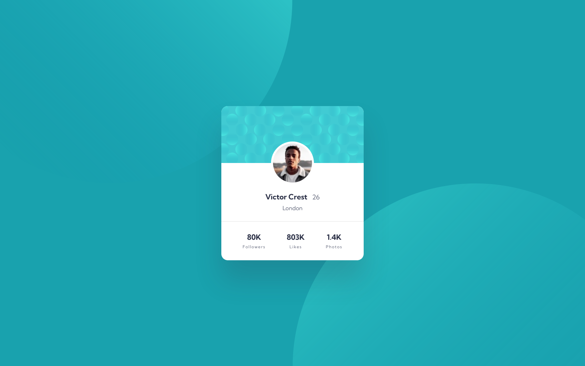

# Frontend Mentor - Profile card component solution

This is a solution to the [Profile card component challenge on Frontend Mentor](https://www.frontendmentor.io/challenges/profile-card-component-cfArpWshJ). Frontend Mentor challenges help you improve your coding skills by building realistic projects. 

## Table of contents

- [Overview](#overview)
- [Screenshot](#screenshot)
- [Links](#links)
- [What I learned](#what-i-learned)
- [Useful resources](#useful-resources)
- [Author](#author)

## Overview

This card looks like a child's play but it might take some time for newbies if you are a maniac of symmetry.

## Screenshot



## Links

- Solution URL: [GitHub Repository](https://github.com/joangute/mentor-solution_profile-card/)
- Live Site URL: [GitHub Pages](https://joangute.github.io/mentor-solution_profile-card/)

## What I learned

Positioning could be tricky, to position my two background images I started with random values in the x and y axis, it looked good but it was not even, then I used the keyword values 'top','bottom','right','left' mixed with propotional values for each image. The result was perfectly symmetrical:

```css
body {
  background-position: top -50vh left -20vh, bottom -50vh right -20vh;
}
```

## Useful resources

- [Kevin Powell youtube tutorial](https://www.youtube.com/watch?v=3T_Jy1CqH9k&t=58s) - This is a great explanation about css background image positioning.

## Author

- Frontend Mentor - [@joangute](https://www.frontendmentor.io/profile/joangute)